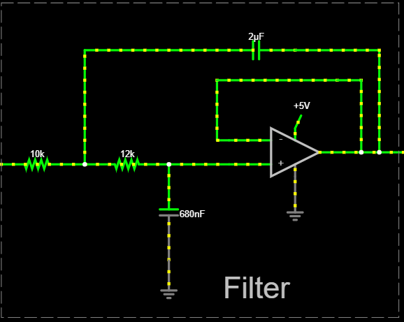
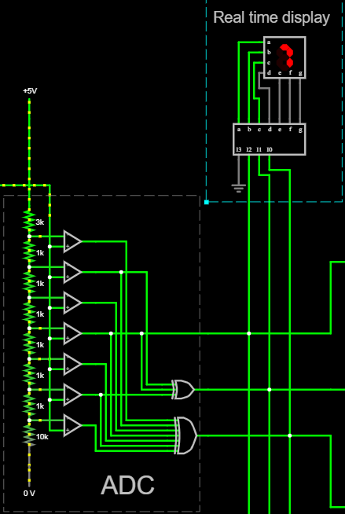
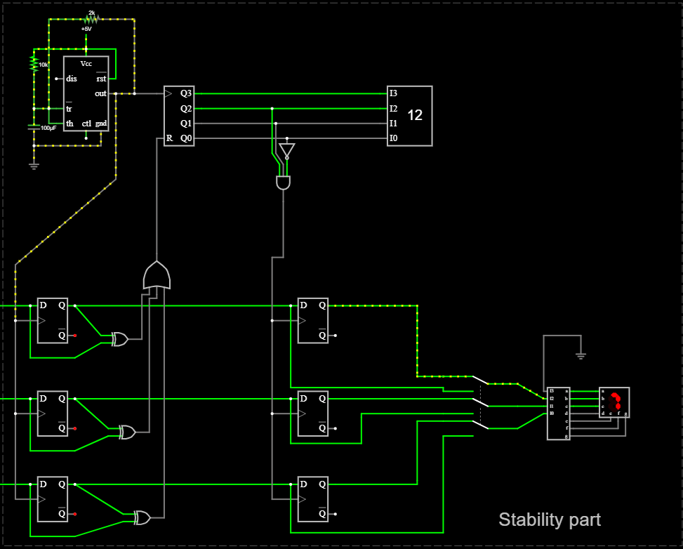
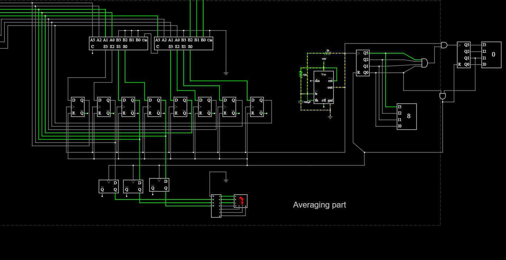

# ALII – Ambient Light Intensity Indicator

## Introduction
The **ALII (Ambient Light Intensity Indicator)** module monitors ambient light intensity using an **LDR** and displays light levels from **0 to 7** on a **seven-segment display**, along with an **average light level over time**.  

The system promotes **energy conservation** by enabling optimized artificial lighting, enhances **urban safety**, and supports **sustainable integration with solar-powered systems**.

A key design constraint of this project is that it is implemented **without programmable devices or pre-built control ICs**, relying solely on **analog components, logic gates, counters, and flip-flops**.

---

## Feature 1: Analog Filtering Stage
To eliminate **50–100 Hz noise** introduced by AC-powered lighting, a **3rd-order Sallen–Key low-pass filter** was implemented.

### Filter Design
- **2nd-order Sallen–Key filter**
  - R₁ = 10 kΩ  
  - R₂ = 12 kΩ  
  - C₁ = 2 µF, C₂ = 680 nF    
  - Quality factor, **Q = 0.707 (Butterworth response)**  

### Design Decisions
- Cascaded filtering provides **>60 dB attenuation at 100 Hz**
- Ripple reduced from **~700 mV to <1 mV**
- Single-supply **LM358 op-amps** powered from a **5 V rail**

**LTspice simulations** confirmed approximately **64 dB noise rejection**, while preserving slow ambient light variations.

  

  <em> 📷 *LTspice simulation – ripple elimination* </em>

---

## Feature 2: LDR Sensing and Seven-Segment Display
The **LDR** is configured in a **voltage divider** with a **10 kΩ resistor**, producing an output voltage between **0–5 V** proportional to ambient light intensity.

### Signal Processing
- Filtered signal applied to **three comparators (LM358)**
- Reference voltages spaced at **0.625 V steps**
- Generates a **3-bit binary output (levels 0–7)**

A **CD4026 decade counter/decoder** drives a **common-cathode seven-segment display**.

### Key Design Choices
- Comparator-based ADC avoids banned ICs
- Discrete logic implementation for level detection
- LDR calibrated for near-linear response across full range

**Proteus simulation** verified correct operation from **0 (dark)** to **7 (bright)**. 

  

  <em> 📷 *Screenshot: Comparator circuit and seven-segment display output* </em>

---
 

## Feature 3: Avoiding Sudden Variations
To prevent display flicker caused by rapid or transient light changes, a **stability-check mechanism** was implemented.

### Circuit Operation
- **555 timer** in astable mode
  - 1 MΩ potentiometer
  - Adjustable delay: **30–300 seconds**
- Timer clocks a **4017 decade counter**
- **XOR gates** detect level changes
- **7474 D flip-flops** latch the display only after stability

An **SPDT switch** allows this feature to be bypassed if required.

### Results
- Rapid light changes do **not** update the display
- Display updates only after the selected delay period

**Proteus demonstrations** confirmed stable operation.

  

  <em>  📷 *Screenshot: Timer, counter, and latch circuitry* </em>

---
 

## Feature 4: Average Light Intensity Display
A second averaging module displays the **average ambient light level** over a longer time window.

### Averaging Method
- Second **555 timer** with adjustable interval (**300–900 seconds**)
- Periodic sampling of light levels
- Accumulation using **7483 binary adders**
- Division by number of samples to obtain average level (0–7)
- Output shown on a **second seven-segment display**
- Pushbutton reset using **flip-flop clear**

### Design Rationale
- Discrete sampling and averaging without microcontrollers
- Approximate **10-sample averaging** provides a holistic view of lighting conditions

Simulation results demonstrated effective long-term light intensity representation.

 

  

  <em>  📷 *Screenshot: Timer, counter, and latch circuitry* </em>

---
 

## Summary
The ALII module demonstrates how **analog signal conditioning, digital logic, and timing circuits** can be combined to create an intelligent light-monitoring system without programmable devices. It is suitable for **energy-efficient buildings, smart urban lighting, and sustainable systems**.
